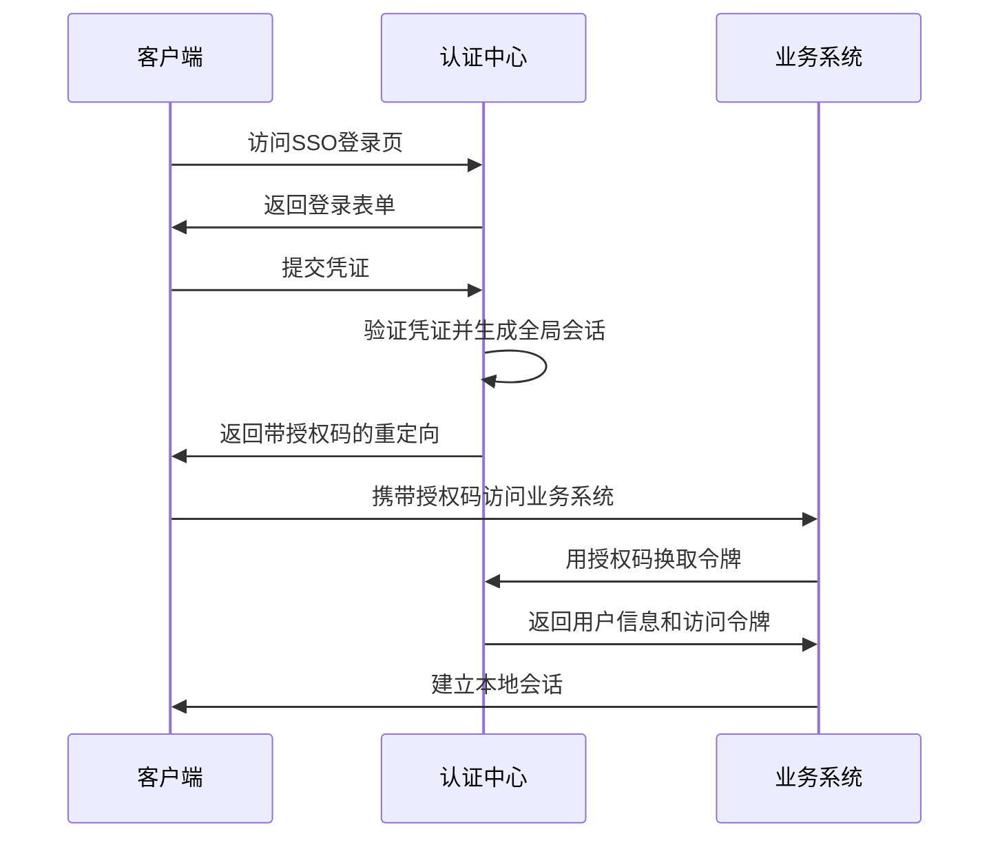

# 认证服务登录功能设计方案

## 1. 核心功能概述

### 1.1 功能模块
- **基础认证**：用户名/密码登录
- **单点登录(SSO)**：跨系统统一认证
- **社交登录**：集成第三方平台(OAuth2.0)
- **统一身份管理**：用户身份中心化存储
- **多因素认证**：增强安全性

## 2. 技术架构设计

### 2.1 分层架构
```
┌─────────────────────────────────────────────────┐
│                   客户端层                       │
│  (Web/App/第三方应用)                           │
└───────────────┬─────────────────┬───────────────┘
                │                 │
┌───────────────▼─────┐ ┌─────────▼───────────────┐
│      API网关层      │ │       CDN/边缘节点      │
│ (路由/限流/协议转换)│ │ (静态资源/登录页面缓存)  │
└───────────────┬─────┘ └─────────────────────────┘
                │
┌───────────────▼─────────────────────────────────┐
│                 认证服务层                       │
├─────────────────────────────────────────────────┤
│  ┌─────────────┐  ┌─────────────┐  ┌──────────┐ │
│  │ OAuth2.0    │  │ SAML/OpenID │  │ JWT服务  │ │
│  │ 社交登录模块 │  │ SSO模块     │  │          │ │
│  └─────────────┘  └─────────────┘  └──────────┘ │
├─────────────────────────────────────────────────┤
│  ┌─────────────┐  ┌─────────────┐  ┌──────────┐ │
│  │ 密码管理    │  │ MFA服务     │  │ 风险控制 │ │
│  │ (加密/哈希) │  │ (OTP/生物)  │  │ (IP/设备)│ │
│  └─────────────┘  └─────────────┘  └──────────┘ │
└───────────────┬─────────────────────────────────┘
                │
┌───────────────▼─────────────────────────────────┐
│                 数据存储层                       │
├─────────────────────────────────────────────────┤
│  ┌─────────────┐  ┌─────────────┐  ┌──────────┐ │
│  │ 用户数据库  │  │ 会话缓存    │  │ 审计日志 │ │
│  │ (分库分表)  │  │ (Redis集群) │  │ (ES)     │ │
│  └─────────────┘  └─────────────┘  └──────────┘ │
└─────────────────────────────────────────────────┘
```

### 2.2 关键技术选型

| 组件          | 推荐方案                          | 备选方案               |
|---------------|-----------------------------------|-----------------------|
| 认证协议      | OAuth2.0 + OpenID Connect        | SAML 2.0             |
| 会话管理      | JWT + Redis                      | 传统Session           |
| 密码安全      | Argon2id/BCrypt                  | PBKDF2               |
| 社交登录      | 官方SDK + 网关统一接入           | 自研适配层           |
| SSO实现       | Spring Security OAuth2           | Keycloak/Auth0       |
| 风险控制      | 设备指纹 + 行为分析              | 规则引擎             |
| 数据存储      | MySQL集群 + Redis + Elasticsearch| MongoDB              |

## 3. 关键实现细节

### 3.1 单点登录流程


### 3.2 社交登录集成
```python title="auth/social_login.py"
class SocialLoginHandler:
    def __init__(self):
        self.providers = {
            'wechat': WeChatAdapter(),
            'google': GoogleAdapter(),
            # ...其他平台
        }
    
    async def authenticate(self, provider: str, auth_code: str):
        adapter = self.providers.get(provider)
        if not adapter:
            raise InvalidProviderError()
        
        # 获取用户唯一标识
        social_id = await adapter.get_user_id(auth_code)
        
        # 关联本地账号或创建新用户
        return self._find_or_create_user(social_id, provider)
```

### 3.3 安全增强措施
1. **防御策略**：
   - 密码暴力破解：滑动窗口限流(如5次/分钟)
   - CSRF防护：SameSite Cookie + State参数
   - 敏感操作：强制二次认证

2. **数据安全**：
   ```java title="com/security/PasswordService.java"
   public class PasswordService {
       private final int iterations = 15;
       private final int memoryCost = 65536;
       
       public String hashPassword(String raw) {
           return Argon2.hash(raw, memoryCost, iterations);
       }
       
       public boolean verify(String raw, String hashed) {
           return Argon2.verify(hashed, raw);
       }
   }
   ```

## 4. 部署架构建议

### 4.1 高可用部署
```
                   ┌─────────────┐
                   │    SLB      │
                   └──────┬──────┘
                          |
           ┌──────────────┼──────────────┐
           ▼              ▼              ▼
     ┌──────────┐  ┌──────────┐  ┌──────────┐
     │ 认证服务  │  │ 认证服务  │  │ 认证服务  │
     │ 节点1    │  │ 节点2    │  │ 节点3    │
     └────┬─────┘  └────┬─────┘  └────┬─────┘
          │             │             │
          └──────┬──────┴──────┬──────┘
                 ▼             ▼
          ┌──────────┐  ┌──────────┐
          │ Redis    │  │ MySQL    │
          │ 集群     │  │ 主从     │
          └──────────┘  └──────────┘
```

### 4.2 关键指标
- 认证延迟：< 500ms (P99)
- 并发能力：≥ 10,000 TPS
- 可用性：99.99%

## 5. 演进路线建议

1. **阶段1**：实现核心认证流程
   - 基础登录+JWT
   - 简单的社交登录集成

2. **阶段2**：增强能力
   - 完整SSO支持
   - MFA集成
   - 风险控制引擎

3. **阶段3**：平台化
   - 开发者门户
   - 权限可视化配置
   - 审计分析看板

需要查看当前项目中已有的认证相关代码或配置吗？可以协助分析现有实现并提供具体改进建议。